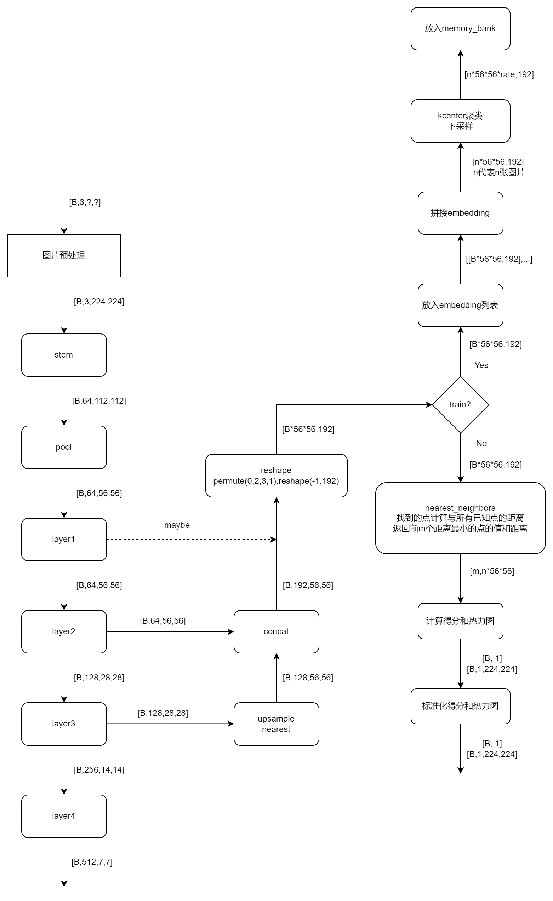

# PatchCore

This is the implementation of the [PatchCore](https://arxiv.org/pdf/2106.08265.pdf) paper.

Model Type: Segmentation

## Description

The PatchCore algorithm is based on the idea that an image can be classified as anomalous as soon as a single patch is anomalous. The input image is tiled. These tiles act as patches which are fed into the neural network. It consists of a single pre-trained network which is used to extract "mid" level features patches. The "mid" level here refers to the feature extraction layer of the neural network model. Lower level features are generally too broad and higher level features are specific to the dataset the model is trained on. The features extracted during training phase are stored in a memory bank of neighbourhood aware patch level features.

During inference this memory bank is coreset subsampled. Coreset subsampling generates a subset which best approximates the structure of the available set and allows for approximate solution finding. This subset helps reduce the search cost associated with nearest neighbour search. The anomaly score is taken as the maximum distance between the test patch in the test patch collection to each respective nearest neighbour.

## Architecture


## Usage

`python tools/train.py --model patchcore`

## Benchmark

All results gathered with seed `42`.

## [MVTec AD Dataset](https://www.mvtec.com/company/research/datasets/mvtec-ad)

### Image-Level AUC

|                |  Avg  | Carpet | Grid  | Leather | Tile  | Wood  | Bottle | Cable | Capsule | Hazelnut | Metal Nut | Pill  | Screw | Toothbrush | Transistor | Zipper |
| -------------- | :---: | :----: | :---: | :-----: | :---: | :---: | :----: | :---: | :-----: | :------: | :-------: | :---: | :---: | :--------: | :--------: | :----: |
| Wide ResNet-50 | 0.980 | 0.984  | 0.959 |  1.000  | 1.000 | 0.989 | 1.000  | 0.990 |  0.982  |  1.000   |   0.994   | 0.924 | 0.960 |   0.933    |   1.000    | 0.982  |
| ResNet-18      | 0.973 | 0.970  | 0.947 |  1.000  | 0.997 | 0.997 | 1.000  | 0.986 |  0.965  |  1.000   |   0.991   | 0.916 | 0.943 |   0.931    |   0.996    | 0.953  |

### Pixel-Level AUC

|                |  Avg  | Carpet | Grid  | Leather | Tile  | Wood  | Bottle | Cable | Capsule | Hazelnut | Metal Nut | Pill  | Screw | Toothbrush | Transistor | Zipper |
| -------------- | :---: | :----: | :---: | :-----: | :---: | :---: | :----: | :---: | :-----: | :------: | :-------: | :---: | :---: | :--------: | :--------: | :----: |
| Wide ResNet-50 | 0.980 | 0.988  | 0.968 |  0.991  | 0.961 | 0.934 | 0.984  | 0.988 |  0.988  |  0.987   |   0.989   | 0.980 | 0.989 |   0.988    |   0.981    | 0.983  |
| ResNet-18      | 0.976 | 0.986  | 0.955 |  0.990  | 0.943 | 0.933 | 0.981  | 0.984 |  0.986  |  0.986   |   0.986   | 0.974 | 0.991 |   0.988    |   0.974    | 0.983  |

### Image F1 Score

|                |  Avg  | Carpet | Grid  | Leather | Tile  | Wood  | Bottle | Cable | Capsule | Hazelnut | Metal Nut | Pill  | Screw | Toothbrush | Transistor | Zipper |
| -------------- | :---: | :----: | :---: | :-----: | :---: | :---: | :----: | :---: | :-----: | :------: | :-------: | :---: | :---: | :--------: | :--------: | :----: |
| Wide ResNet-50 | 0.976 | 0.971  | 0.974 |  1.000  | 1.000 | 0.967 | 1.000  | 0.968 |  0.982  |  1.000   |   0.984   | 0.940 | 0.943 |   0.938    |   1.000    | 0.979  |
| ResNet-18      | 0.970 | 0.949  | 0.946 |  1.000  | 0.982 | 0.992 | 1.000  | 0.978 |  0.969  |  1.000   |   0.989   | 0.940 | 0.932 |   0.935    |   0.974    | 0.967  |

### Sample Results


# 过程

## 流程图



## train

resnet18的layer2输出 `[b,128,64,64]` 的数据，layer3输出 `[b,256,32,32]` 的数据，layer3经过上采样和layer拼接，形状变为了 `[b,384,64,64]`，经过转置变形为 `[b*64*64, 384]`，都放到 `embeddings` 列表中，训练完成后开始验证时，将`embeddings`列表中的数据拼接到一起，形状为`[131072, 384]`，再进行subsample，保留10%的数据，在分辨率为512的情况下，保留数据形状为`[13107, 384]`，放入模型中的`memory_bank`中使用。


## infer

resnet18的layer2输出 `[1,128,64,64]` 的数据，layer3输出 `[1,256,32,32]` 的数据，layer3经过上采样和layer拼接，形状变为了 `[1,384,64,64]`，经过转置变形为 `[64*64, 384]`，这个输出的数据会和保存的`memory_bank`中的`[13107, 384]`数据进行最临近算法计算，预测值的每个点依次和`memory_bank`中的点计算距离得到形状`[64*64, 13107]`的矩阵，保留最小（近）的前n个，之后计算得到最终的热力图和置信度。

```yml
tools/inference.py -> stream():
	stream():
		get_args()获取参数
		通过参数读取模型并调用infer()函数推理
	infer():
		调用Inferencer(ABC)的predict()函数得到混合后的图像和得分
		之后通过add_label()函数将置信度加到图片中


anomalib/deploy/inferencers/base.py -> Inferencer(ABC):
	预测主要使用 predict
	predict():
        调用了pre_process()，forward()，post_process()并返回标准化的热力图和score（这三个函数在子类中实现了）
        post_process()后使用了superimpose_anomaly_map()将热力图和原图叠加
        superimpose_anomaly_map()调用了anomaly_map_to_color_map()函数将单通道热力图转换为rgb
        最终返回混合后的图像和得分给inference.py


anomalib/deploy/inferencers/torch.py -> TorchInferencer(Inferencer):
	__init__():
        load_model()读取模型
        _load_meta_data()读取metatada,Inferencer(ABC).predict()还将原图尺寸保存在里面

	实现父级的pre_process()，forward()，post_process()函数
	其中post_precess函数调用了父级的_normalize，实现了热力图和得分的标准化

	load_model():
		调用anomalib/models/__init__.py -> get_model()获得模型
			get_model()会根据参数获得对应的模型
		使用model.load_state_dict()载入权重

	_load_meta_data():
		调用anomalib/deploy/optimize.py -> get_model_metadata()
		得到的有image_threshold，pixel_threshold，min，max

	pre_process():
		调用anomalib/pre_precessing.py -> PreProcessor
		主要是缩放图片，标准化，ToTensor

	forward():
		self.model(image)					# 这个模型是anomalib/models/compoents/base/anomaly_module.py -> AnomalyModule()
			-> AnomalyModule().forward()
				-> self.model(batch)		# 这个模型是anomalib/models/patchcore/torch_model.py -> PatchcoreModel()
					-patchcore.forward()

	post_process():
		将forward获得的热力图(1,1,512,512)和score(1.0392)标准化，使用了metadata中的min和max
		将图片还原到原图尺寸
		返回标准化的热力图和score


anomalib/models/patchcore/lightning_model.py -> Patchcore(AnomalyModule) -> AnomalyModule(pl.LightningModule, ABC):
	实现了pytorch_lightning的训练函数，实例化了下面的PatchcoreModel
	training_step():
		将每次训练过程中的结果([64*64, 384])放入列表中保存

	on_validation_start():
		将训练过程中保存的列表拼接起来，通过Patchcore模型中的subsample_embedding()下采样保留10%数据，放入model.memory+bank中


anomalib/models/patchcore/torch_model.py -> PatchcoreModel(DynamicBufferModule, nn.Module): 主要模型
	forward():
		t
```

